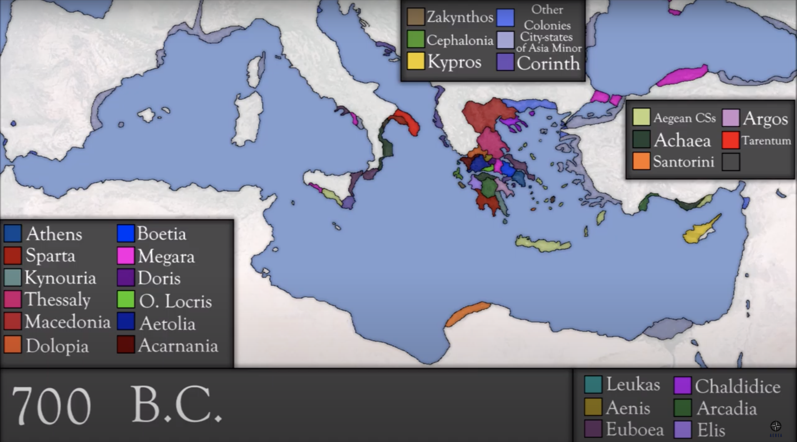
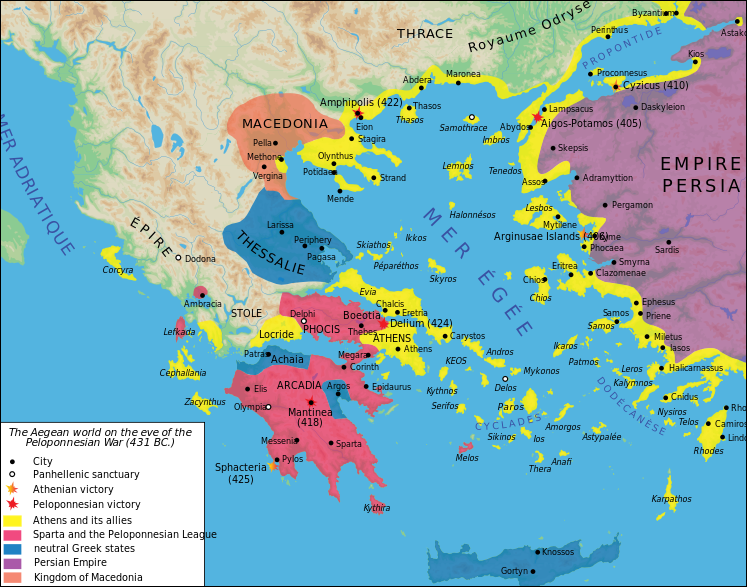
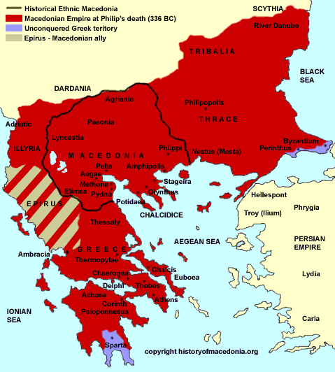
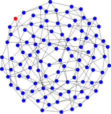

```{r setup, include=FALSE}
options(digits=4)
knitr::opts_chunk$set(echo = TRUE)

setwd('~/Dropbox/Documents/school/grad/609/statesim/statesim/paper')

library(dplyr)
library(flexsurv)
library(ggplot2)
library(jsonlite)
library(survival)
library(survminer)
```


# Introduction

Most international relations theorists are not known outside the academia or Washington D.C., but the ones that are---including Thucydides, Machiavelli, and Henry Kissinger---typically belong to the _realist_ school. Despite its prominence, a specifically realist doctrine can be difficult to pin down. Not only do realist theorists often start from different assumptions, they can also generate contradictory hypotheses.

Perhaps the three central questions of realist discourse are:

1. How does a community of states (_state system_) maintain stability?

2. What contributes to individual states' likelihood of survival?

This paper uses a computer simulation to test competing answers to these questions, within the realist framework. Simulations obviously lack the theoretical heft of a true experiment, or even an observational study. The purpose of the simulation is to clear up inter-realist confusion, and at establish internal consistency.

Much of this study is based on Cusack and Stoll...

The next section introduces to concept of state systems. From there, I briefly describe the mechanics of the simulation. The results of 1594 runs are analyzed with regression analysis.

The simulation was written in Python 3. The code and the simulation records are entirely available at https://github.com/benhorvath/statesim/.


# States and state systems

How collectives of humans organize their affairs is a historically contingent question. In this study, I take _states_---loosely defined---as the unit of analysis. For our purposes, we can define a state as a singular entity that controls a body of territory and the associated resources and people. A state has a monopoly of force within this territory, and there is authority greater than it. Legally, it is 'equal' to all other states. States attempt to reproduce itself by adhering to the dictates of its circumscribed reason.

A _state system_ is thus loosely defined as a collection of such states, the relationships between states including _de jure_ and _de facto_ rules of conduct, and the distribution of power between them. I write 'loosely defined' because I do not intend to reference history only after the Treaty of Westphalia (1648).

The example of ancient Greece should suffice as an illustration. Urban settlements began to form in Greece in the 8th century BC, following a three century dark age. By 700 B.C. the state system was composed of 24 states (Cusack and Stoll 1990, 17).



The size of the system increased with new territory, until it reached its peak at size 40 in 430 B.C., just as the Peloponesian War started. 



Alexander the Great came along in 338 B.C. in Macedonia. He was able to establish a universal empire in Greece and the Persian Empire, as well as other impact other state systems in the ancient world. Alexander's conquest destroyed the _plurality_ of the system, leaving only one state master of the others.



The Greek system retained its multipolar character for almost 500 years, before collapsing into universal empire. Is a universal empire the final result in any state system? What dynamics speed up or slow down this consolidating process? Relatedly, what explains the 'lifetime' of individual states? What mechanisms or even policies can be employed to prevent universal empire and state death?

These are the questions this simulation seeks answers to. p. 97:

* $T_0$: Automatic stabilization theory. State systems naturally endure, blah balh, free market analogy

* $T_1$: May be above: Equslity or iequality of power promotes endurance?

* Uneven growth

* Norms (restraint)

* Accurate perception

* Descrutiveness of war

* Relative losses of war


# The Simulation

The state system is represented by a _regular random_ grpah network, where each node is a state and each edge is a border. These networks have two parameters: $n$, defining the number of nodes (states), and $p$, defining the number of edges ('borders') between them. For all simulations in this paper, I have set $n=98$ and $p=8$. Although it is easy to configure the simulation to other values, this paper does not investigate. \footnote{This representation is probably the greatest difference from Cusack and Stoll. They represented the state system on a hexagonal grid, wtih 98 cells. States on average border six other states. Part of the warfare process involves states capturing parts of other cells from vanquished enemies. See below on the 'Versaille rule' for how I attempt to account for this.}



The very first step is creating the 'world.' This involves loading the configured parameters and generating the graph. It also involves endowing each state with its most important characteristic: power. States are randomly assigned a power level from a normal distribution with mean and standard deviation defined in the config file.

After creating the world and loading the configured parameters, the simulation occurs over a number of iterations (`niter` parameter, usually 1000) that follow four phases:

**TODO table of config parameters and values used**

1. Select two states to generate 'the action' of the turn

2. Diplomacy

3. War (potentially)

4. Power adjustment

## Phase 1: Select the protagonist state

The protagonist is selected at the beginning of each term, randomly but in proportion to its overall power. I.e., more powerful states will have more opportunities to push other states around and start wars. Cusack and Stoll note research suggesting this is consistent with the historical record (Cusack and Stoll ????, ?).

## Phase 2: Diplomacy

The selected state looks to its borders, examining all the other nearby states. It calculates the power differential between itself and them. As in real-life, this calculation is not 100 percent accurate. It is possible for the state to over- and underestimate its advantage relative to its opponents. If we let $E(p_ij)$ indicate state $i$'s estimation of state $j$'s power:

$$ E(p_{ij})  = p_j \times (1 + randnorm(0, \sigma_{perception})) $$

It is this number, not the actual power level, a state compares itself with. 

After calculating its neighbhors power, the state selects the state it has the greatest power differential with for a dispute. If the state estimates all of its neighbors are stronger than it, the turn 'ends' and the simulation skips over the diplomacy and war phases.

Otherwise, the targetted state in turn estimates the power of the aggressor state. If it finds itself more powerful than the aggressor, it does not (for now). But if it finds itself wanting, it proceeds to building an alliance. 

A state trying to build an alliance first estimates the power of every other state that borders the aggressor state. It then puts together the _minimal winning coalition_. This is the set of states that more powerful than the aggressor state (as estimated by the state), but only just. **TODO MINIMIAL WINNING COALITION** The targeted state 'writes a treaty' for each potential member of the alliance to sign and sends it out. Each potential treaty member decides whether to accept it, independently and without consideration to whether the other potential partners accept.

How are these potential allies evaluating the proposal? These states are progammed to be very naive---there's nothing sophisticated about them. Their only goal is end up on the winning side. That is, if they judge the assembled coalition as more powerful than the offensive state, they will sign up for that alliance. If they view the offensive power as more powerful, they reject the alliance.

This generates much of the 'tension' in the simulation. States ability to misestimate other states power can result in the wrong alliances being formed, or only partial alliances being formed. This can be disastrous to the defending state.

Once the alliance has been formed, the aggressor state has an opportunity to revisit his estimate of the targeted power. If it finds that its estimation puts the targeted state and its alliance as still weaker than itself, it immediately goes to war against the new alliance. However, if it views itself as the weaker party now, the agressor state now has the opportunity to form its own alliance. This proceeds as above. Again, the other states that recieve a proposal from the aggressor state only ask themselves, is this alliance more powerful than the targeted state's alliance? 

If any of the aggressor state's proposed allies reject the alliance, the aggressor state backs down. The turn ends.

If the aggressor state succeeds in forming its own alliance, then the action returns to the targeted state. They have one more chance to try to assemble a bigger coalitition. This time proceeds as before.

The aggressor state estimates its alliance and the final defensive alliance one last time. If it regards itself as more powerful, war is fought. Otherwise, it backs down and the war ends.

## Phase 3: War

Wars contain three issues:

1. Who wins the war?
2. How are the costs distributed between the combatants?
3. How are the benefits, i.e., 'spoils of war', distributed between the combatants?

### Likelihood of victory

The outcome of a war between two states naturally relies on the power differential between them. We expect that on average states with more power should defeat states with less power. But there is still a role for chance, and in the history of warfare, objectively less powerful forces have prevailed. The prominence of chance versus material superiority is parameterized as $\sigma_{victory}$.

Likelihood of victory (LV) is modeled as a logistic function, where $\sigma_{victory}$ controls how _steep_ the curve is in the middle. The figure shows curves for $\sigma_{victory} = (1, 2, 4)$ (black, red, and blue). For all curves, if there is zero difference in power, the initiator has a fifty percent change of victory. However, once the initiator has double the power, the probability of winnign varies greatly. Where $\sigma_{victory} = 1$, $LV$ is around 0.75; for $\sigma_{victory} = 2$, it's closer to 0.85; for $\sigma_{victory} = 4$, it's near 1. That is, the role of chance decreases as $\sigma_{victory}$ increases.

```{r, echo=FALSE, fig.cap='Likelihood of victory, where sigma_{victory} = (1, 2, 4)$ for black, red, and blue, respectively.'}
LV <- function(x, sigma) 1 / (1 + exp(-x*sigma))

plot(seq(-3, 3, .1), LV(seq(-3, 3, .1), 1), type='l', ylim=c(0,1),
     xlab='Power differential', ylab='Likelihood of victory', main='Likelihoods of victory')
lines(seq(-3, 3, .1), LV(seq(-3, 3, .1), 2), col='red')
lines(seq(-3, 3, .1), LV(seq(-3, 3, .1), 4), col='blue')
rect(-3.24, -0.15, 0, .5, lty=2)
```

** IS THIS THE CDF OF NORMAL DISTRIBUTION? MAKING THE PDF THE ORIGINAL EQUATION? **

To calculate $LV$ exactly, we use an integral on a logistic function to find the area beneath the curve, from negative infinity to the logged power differential. That is, state $i$'s likelihood of victory over state $j$ is (where $\sigma \equiv \sigma_{victory}$):

$$ LV_{ij} = \frac{1}{\sqrt{\pi \sigma}} \int_{ -\infty }^{ ~ ln(p_i/p_j) } e^{-(x / \sigma)^2} ~ dx $$


### Costs of war

Both sides in a war incur a cost. We want this cost to have three properties:

1. All sides should incur some cost in a war
2. The losing side should incur a higher cost than the winning side
3. The damage caused by a war increases as the power differential between the two sides decreases

On 3: Thus war between Nazi Germany and the Soviet Union was extremely destructive, but war between Nazi Germany and Denmark caused almost no damage.

Since one of our hypotheses regards the desctructiveness of wars, we have parameterized this. $C_{max}$ is the maximum a war can cost, and varies across the simulations. ALSO WARCOST DISPARITY

Thus a war's cost is given by:

$$C_i = \left( 1 - \frac{LSR - 0.5}{0.5} \right) \times C_{max}$$

where LSR is a ratio of the stronger side's power to the weaker side's power:

$$LSR = \frac{ max(p_i, p_j) }{p_i + p_j}$$

We control the disparity in war costs between the stornger and weaker is war cost disparity parameter. Thus the final cost of a war for both sides uses $C_i$, $C_{max}$, and $LSR$:

$$C_{stronger} = C_i - \left( min( randnorm(0, 1) \times C_{max}, C_{disparity} \right))$$

$$C_{weaker} = C_i + \left( min( randnorm(0, 1) \times C_{max}, C_{disparity} \right))$$

These costs are assessed for all states, including those in coalitions


### Spoils of war

Finally, the winning coalition is allowed to seize some of the resources of the losing coalition. This is simply the reparations parameter times the total power of the losing alliance:

$$I = reparations \times p_j$$

This power forms a pot that is distributed to each member of the winning coalition, proportional to their power contribution to the coalition.


### The Versailles rule

Stoll and Cusack's original simulation had the concept of territory. The leader of the losing side would surrender some of its territory to the members of the victorious coalition.

Since the present simulation has no concept of territory, I opted to create something with similar effects. The leader of the losing state transfers a percentage of their power to the winning side equal to $LSR$. Because this can be quite onerous on the losing state, I have termed it the Versailles rule.

It is parameterized, and capable of being turned off and on. It is a very powerful rule which greatly influences the survivability of state and system.


## Phase 4: Power adjustment and economic growth

Once the diplomacy and wars are settled, the only thing left to do is remove states who no logner have any power and redraw the map (passing the defeated states' borders to the conquering state), and distribute economic growth.

Stoll and Cusack originally used a normal distribution with parameterized mean and standard deviation. Each state gets a different growth rate every turn.

This results in exponential growth over the run of the simulation, and makes economic depressions less frequent than they should be.

To model economic growth more realistically, I draw growth rates from a Cauchey distribution. Negative growth in a single turn is capped at -30 percent, and positive growth is capped at 15 percent.


```{r, echo=FALSE, fig.cap='Cauchey (red) distributions has a thicker tails than the normal distribution (black), more realistically representing the probability of extreme events, like economic depression.'}
set.seed(1804)
x <- seq(-10, 10, by=0.1)
plot(x, dnorm(x), type='l', ylab='Density', main='Normal and Cauchey PDFs')
lines(x, dcauchy(x), col='red')
```


# Results

```{r}
# Read configs
config_paths <- dir('../data/config/', pattern='*.json', full.names=TRUE)
config_files <- lapply(config_paths, function(x) as.data.frame(fromJSON(x, flatten=TRUE)))
config <- do.call(rbind, config_files)

# Read state files
state_paths <- dir('../data/state/', pattern='*.csv', full.names=TRUE)
state_df <- Reduce(rbind, lapply(state_paths, read.csv, stringsAsFactors=FALSE))

# Read system files
system_paths <- dir('../data/system/', pattern='*.csv', full.names=TRUE)
system_df <- Reduce(rbind, lapply(system_paths, read.csv, stringsAsFactors=FALSE))

# Read system files
war_paths <- dir('../data/wars/', pattern='*.csv', full.names=TRUE)
war <- Reduce(rbind, lapply(war_paths, read.csv, stringsAsFactors=FALSE))

 #length(unique(system_df$sim_id))  # simulations
 # nrow(system_df)  # turns
# nrow(war[!is.na(war$outcome),])  # wars
  # number of simulations that ended in universal empire

# Number of simulations that end in universal empire
# system_df %>% group_by(sim_id) %>% summarise(maxturn=max(turn)) %>% mutate(empire=if_else(maxturn>=999, FALSE, TRUE )) %>% # group_by(empire) %>% summarise(n())
```

Ultimately, 1594 simulations were run, requiring about 24 hours of computer time. This represents 846,850 total turns, and 431,510 conflicts that ended in wars.

Most (1140) of the simulations ended in universal empire, or about 71 percent. This is substantially more than Cusack and Stoll report, who reported about 50 percent devolved into universal empire (p. 108). **CHECK THIS**

Let's examine a single simuation to get a sense of what it looks like, ID `20200516t231815`. The figure XX shows the relationship between turn number and state survival. Fifty percent of states survive to turn 354.

```{r, echo=FALSE, fig.cap='State survival probability for simulation ID 20200516t231815.'}
SIM_ID <- '20200516t231815'

ex_state <- state_df %>%
  filter(sim_id == SIM_ID) %>%
  mutate(status = 1)

ggsurvplot(
    fit = survfit(Surv(survived_to, status) ~ 1, data=ex_state), 
    title='Simulation 20200516t231815: State survival',
    xlab='Turn', 
    ylab='State survival probability')
```

Second, we can examine wars in this simulation. Conflict led to war 49 percent of time. We can visualize the cumulative war distribution. Figure XX shows that wars occur at a steady rate through out the simulation, decreasing slightly around turn 750.

```{r, echo=FALSE, fig.cap='Cumulative wars for simulation ID 20200516t231815.'}
war %>% filter(sim_id == SIM_ID) %>% group_by(war) %>% summarise(n())

ex_war <- war %>% filter(sim_id == SIM_ID, war == 'True') %>% mutate(x=1) %>% mutate(cumwar = cumsum(x))

ggplot(ex_war, aes(x=turn, y=cumwar, group=1)) +
  geom_line(col='blue', size=1) +
  labs(x='Turn', y='Cumulative wars') +
  ggtitle('Simulation 20200516t231815: Cumulative wars')
```

Finally, let's examine how the distribution of state power varies over the course of the simulation. Figure XX shows how summary statistics of power vary over time. It is dominated by the state with maximum power (orange), standard deviation (pink), and average (red). The dominant power grows extremely quickly around turn 750, naturally increasing the standard deviation. The average increases very slowly.

```{r, echo=FALSE, fig.cap='Distribution of power over simulation ID 20200516t231815, by summary statistics.'}
ex_system <- system_df %>%
  filter(sim_id == SIM_ID) %>%
  tidyr::gather(var, val, min:sd)

ggplot(ex_system, aes(x=turn, y=val, col=var)) +
  geom_line() +
  labs(x='Turn', y='Power')
```


## State Survival

We'll do the same Kaplan Meier curve procedure as above, except across all of the simulations. The median survival time is 144 turns, across all simulations. This is much lower than the simulation we directly examined above.

```{r, eval=FALSE}
state_df$status <- 1
state_fit <- survfit(Surv(survived_to, status) ~ 1, data=state_df)

print(state_fit)

ggsurvplot(state_fit, data=state_df,
    title='State survival',
    xlab='Turn', 
    ylab='State survival probability')
```

Next, examine the effect of the covariates on state survival time. Although I initially used Cox Proportional Hazard regression methods, I found that the proportional hazards assumption was too strong for this data set, and that a parametric model would suffice. Using an exponential model:

```{r, echo=FALSE}
state_x <- merge(state_df, config, by='sim_id')
state_x$status <- ifelse(state_x$survived_to >= 999, 0, 1)
 
surv_object <- Surv(time=state_x$survived_to, event=state_x$status)

m_state <- flexsurvreg(surv_object ~ power_dist_sigma + misperception_sigma +
                   victory_sigma + max_war_cost + war_cost_disp + reparations +
                   growth_mu + log(growth_sigma) + versailles, data=state_x, dist = "exp")
print(m_state)
```

Visualize the coefficients and their standard error:

```{r, echo=FALSE, fig.cap='Estimated coefficients and standard errors of fitted model of state survival.'}
vars <- as.data.frame( cbind(exp(confint(m_state)), exp(coef(m_state))) )
vars$param <- row.names(vars)
colnames(vars) <- c('lower', 'upper', 'est', 'param')

ggplot(vars, aes(x=param, y=est, color=param)) + 
  geom_point(size=3) +
  labs(x='Parameter', y='Coefficient estimate') +
  ggtitle('State survival model estimated coefficients') +
  geom_errorbar(aes(ymin=lower, ymax=upper, width=0.5)) +
  geom_hline(yintercept=1) +
  ylim(-2, 4) +
  coord_flip()
```

Interpreting this plot is fairly simple: Where the error bar of the fitted parameter touches 1, the parameter is insignificant. All of these parameters are significant, though `power_dist_sigma` is closest to being so. 

Parameters with estimates greater than 1 decrease the odds of state survival, while parameters with estimates below one increase the odds of state survival. 'State survival' can also be interpreted as 'time to state death.' Thus only `growth_mu` increases state survival, i.e., increasing the mean of the economic growth distribution improves states' chance of survival. All other variables lower state survival.

We can examine the different survival curves for different values of these parameters. The impact of the Versailles rule is examined in Figure XX. With the Versailles rule activated, there is almost no probability the simulation will make it to turn 1000 without devolving into universal empire. With it off, this becomes a possibility, though not a great one. With the Versailles rule off, median state survival time is 222 turns; with it on, this shrinks to 116. This sheds light on the parameter estimate from the model being slightly more than 2.

```{r, echo=FALSE, fig.cap='Survival time varies greatly depending on whether the Versailles rule is activated.'}
state_fit2 <- survfit(Surv(survived_to, status) ~ versailles, data=state_x)
ggsurvplot(state_fit2, data=state_x)
```

To evaluate how well our model fits, plot the parametric survival curve used by the model against the non-parametric Kaplan-Meier estimate (in red). We see there is strong alignment between the two, and conclude that the model fits the data fairly well.

```{r, echo=FALSE, fig.cap='Parametric model (black) plotted against non-parametric fit (red). Close agreement between the two indicate the model fits the data well.'}
plot(m_state, main='State survival model fit', xlab='Turn', ylab='State survival probability')
```


## System Survival

We perform the same analysis above, but on the survival of states:

```{r, echo=FALSE}
system_x<- system_df %>%
  group_by(sim_id) %>%
  summarise(survived_to=max(turn)) %>%
  mutate(status = if_else(survived_to >= 999, 0, 1)) %>%
  left_join(config, by='sim_id')

surv_object <- Surv(time=system_x$survived_to, event=system_x$status)

m_system <- flexsurvreg(surv_object ~ power_dist_sigma + misperception_sigma +
                        victory_sigma + max_war_cost + war_cost_disp + reparations +
                        growth_mu + log(growth_sigma) + versailles, data=system_x, dist = "exp")

print(m_system)
```

Plot the estimated coefficients and standard errors:

```{r, echo=FALSE, fig.cap='Estimated coefficients and standard errors of fitted model of system survival.'}
vars <- as.data.frame( cbind(exp(confint(m_system)), exp(coef(m_system))) )
vars$param <- row.names(vars)
colnames(vars) <- c('lower', 'upper', 'est', 'param')

ggplot(vars, aes(x=param, y=est, color=param)) + 
  geom_point(size=3) +
  labs(x='Parameter', y='Coefficient estimate') +
  ggtitle('Systemsurvival model estimated coefficients') +
  geom_errorbar(aes(ymin=lower, ymax=upper, width=0.5)) +
  geom_hline(yintercept=1) +
  ylim(-1, 10) +
  coord_flip()
```

It's immediately obvious these standard errors are much larger than the model of state survival. War cost disparity, standard deviation of initial power distrib ution, and maximum war cost parameters all come up statistically insignificant. The Versailles rule has, again, a strong effect on system survival, along with reparations. 

Plotting the exponential model against non-parametric survival curve shows substantial disagreement. This suggests the model does not fit the data well. Interestly, Cusack and Stoll also found it difficult to fit a model to their system data (PAGE XX). This work observes the same thing.

```{r, echo=FALSE, fig.cap='Parametric model (black) plotted against non-parametric fit (red). Incongruity between the two suggest the exponential model of state survival is a poor fit.'}
plot(m_system, main='System survival model fit', xlab='Turn', ylab='State survival probability')
```


# Conclusions

This study finds that the Versailles rule has the strongest effect on system and state survival. The results of our hypotheses from the introduction can be summarized in a table:

| Concept                       | Variable                      |   State Survival |  System Survival |
|-------------------------------|-------------------------------|-----------------:|-----------------:|
| Unequal distribution of power | `power_dist_sigma`            | negative (small) |              --- |
| Uneven growth                 | log(`growth_sigma`)           |         negative |         negative |
| Shared norms, restraint       | `reparations`                 |         negative |         negative |
| Inccurate perception          | `misperception_sigma`         |         negative |         negative |
| Destructiveness of war        | `max_war_cost`                |         negative |              --- |
| Disparity of losses           | `war_cost_disp`, `versailles` |         negative |         negative |
| Defensive/offensive bearing   | `victory_sigma`               |         negative | negative (small) |

Non-significant results are marked with an em dash, while barely significant results are noted with (small). Otherwise, these parameters all have a negative and significant relationship to both state and system survival.

These results strongly suggest that the 'automatic stabilization' theory of state systems is logically inconsistent. Most of these relationships should be non-significant. Proponents of the automatic stabilization theory contend that shared norms, accuracy of perception, economic growth rates, etc., should have no bearing on system survival. In fact, the opposite is borne out.


# References

For Python code and results of the simulation runs, see the author's GitHub page at: https://github.com/benhorvath/statesim/.

The key reference is Cusack and Stoll (1990b), which is in turn an extension of Bremer and Mihakla (1977). See Cusack (1990) for a short but comprehensive review of the research program, including extensions of the base simulation.

* Bremer, S., and M. Mihakla. 1977. “Machievalli in Machina: Or politics among hexagons.” In _Problems of World Modeling_, ed. K.W. Deutsch, et al. Ballinger.

* Cusack, Thomas R. 1988. “The management of power in a warring state system: An evaluation of balancing, collective security and laissez-faire politics.” WZB Discussion Paper, No. P 88-303. Wissenschaftszentrum Berlin fur Sozialforschung (WZB), Berlin, West Germany. Available at https://www.econstor.eu/bitstream/10419/77607/1/670393525.pdf.

* ---------. 1990. “Realpolitik and multistate system stability.” WZB Discussion Paper, No. P 90-308. Wissenschaftszentrum Berlin fur Sozialforschung (WZB), Berlin, Germany. Available at http://hdl.handle.net/10419/77609/.

* Cusack, Thomas R., and Richard J. Stoll. 1990a. “Adaptation, state survival and system endurance: A simulation study.” _International Political Science Review_ vol. 11, no. 2: 261--78.

* ---------. 1990b. _Exploring Realpolitik: Probing International Relations Theory with Computer Simulation_. Lynne Rienner Publishers.

* Cusack, Thomas R., and Uwe Zimmer. 1989. “Realpolitik and the bases of multistate system endurance.” _Journal of Politics_ vol. 51, no. 2: 247--85.

* Duffy, Gavan. 1992. “Concurrent interstate conflict simulations: Testing the effects of the serial assumption.” _Mathematical and Computer Modelling_ vol. 16, no. 8–9: 241--70.

* Stoll, Richard J. 1987. “System and state in international politics: A computer simulation of balancing in an anarchic world.” _International Studies Quarterly_ vol. 31: 387--402.


